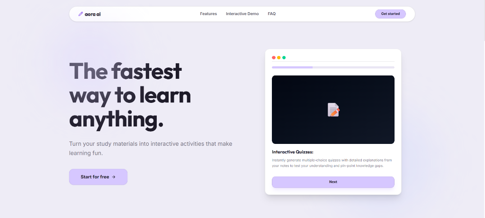
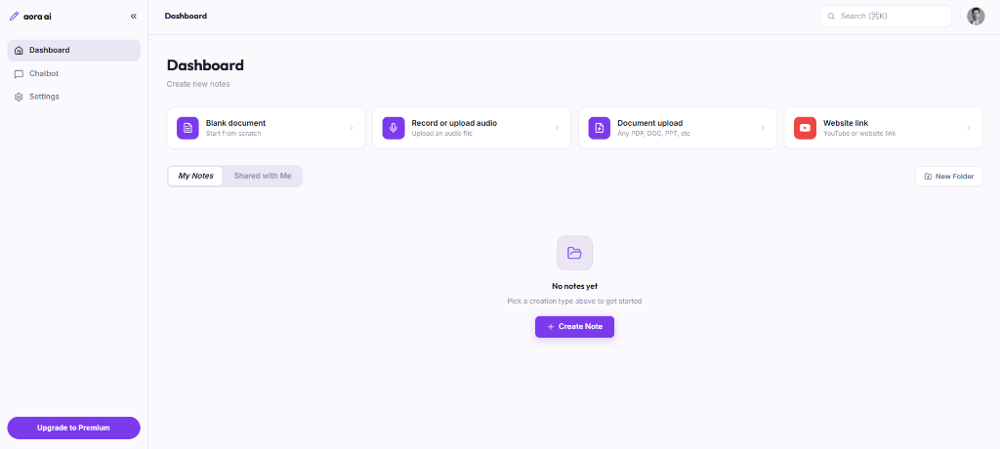
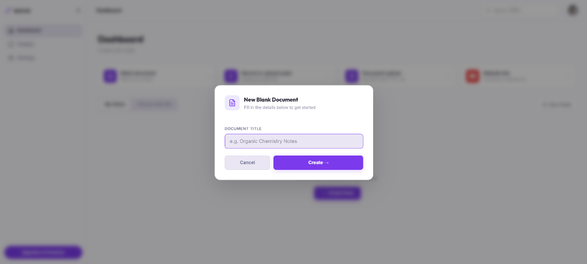
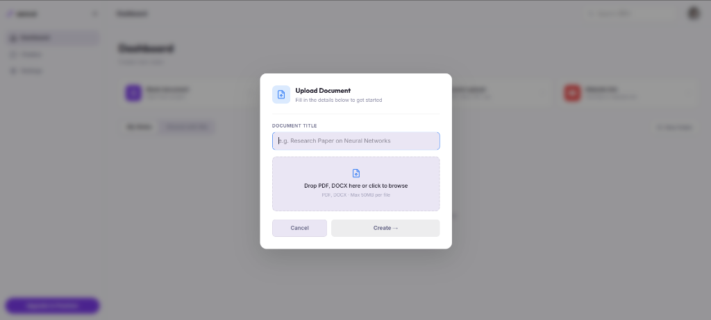
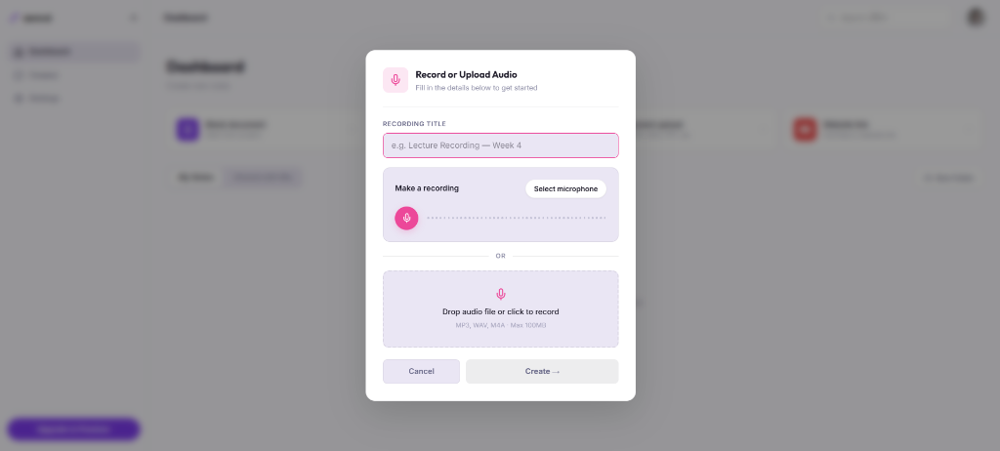
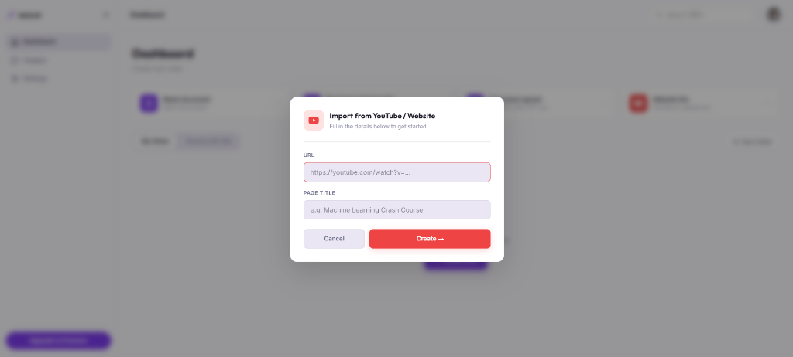
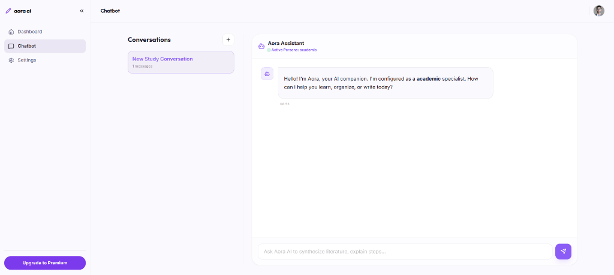
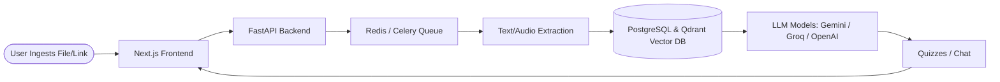

# Aora AI 🚀

Aora AI is an interactive, AI-powered learning platform that turns your textbooks, lecture notes, audio recordings, or YouTube videos into interactive study guides and quizzes.

---

## 📸 Screenshots

### Landing Page & Main Dashboard




---

## 📖 How to Use Aora AI

### 1. Upload Study Materials
Click any creation button on the dashboard to import your content.

<details>
<summary><b>📷 Click to expand creation screenshots</b></summary>
<br/>

<table>
  <tr>
    <td align="center"><b>New Blank Document</b></td>
    <td align="center"><b>Upload Document</b></td>
  </tr>
  <tr>
    <td></td>
    <td></td>
  </tr>
  <tr>
    <td align="center"><b>Record or Upload Audio</b></td>
    <td align="center"><b>Import Link (YouTube/Web)</b></td>
  </tr>
  <tr>
    <td></td>
    <td></td>
  </tr>
</table>

</details>

* **Blank Document**: Write or paste raw notes.
* **Document Upload**: Process PDFs, Word docs, or slides.
* **Record/Upload Audio**: Transcribe lecture recordings.
* **Website Link**: Extract transcripts from YouTube videos or web pages.

### 2. Learn & Test Yourself
Open your note to interact with it:
* **AI Chat**: Chat directly with your document to clear up doubts.
  
  

* **Practice Quizzes**: Automatically generate multiple-choice quizzes with detailed explanations to test and verify your understanding of the material.

---

## 🔄 Application Flow



* **Ingestion**: Uploaded study materials are queued asynchronously via **Celery & Redis** to keep the UI fast.
* **Processing**: Text is extracted, converted to embeddings, and indexed in the **Qdrant Vector Database** for semantic search (RAG).
* **Generation**: LLMs generate quizzes and interactive chatbot responses directly from the stored context.

---

## 🛠️ Quick Start

### 1. Prerequisites
* **Node.js** (v18+) & **Python** (v3.10+)
* Docker (for Redis and Qdrant database containers)

### 2. Run Locally
From the project root:
```bash
# Run both Next.js frontend and FastAPI backend dev servers
npm run dev
```
* **Frontend**: `http://localhost:3000`
* **Backend**: `http://localhost:8000`
